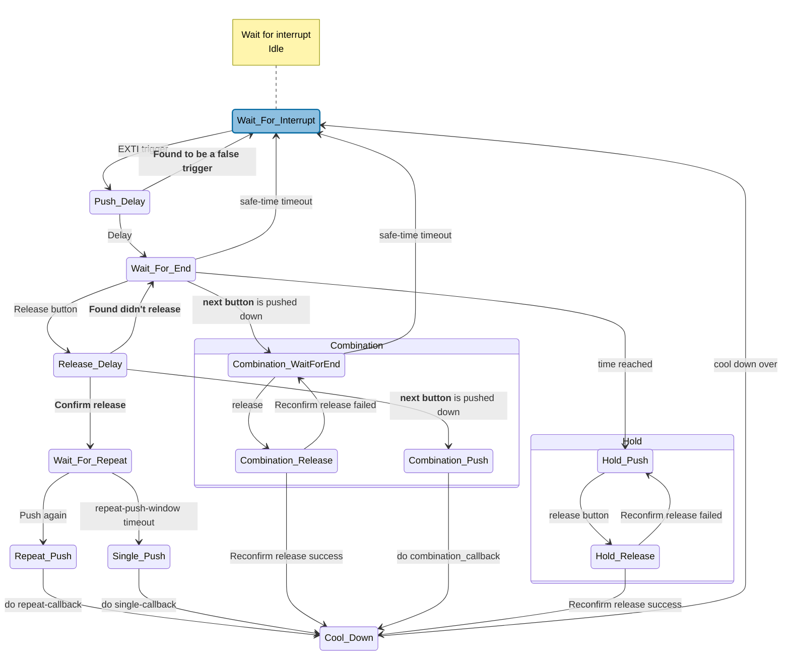

# Simple-Button
[English](./README.md)
[中文](./README_zh.md)

---

## Contents

- [Contents](#contents)

- [Brief Introduction](#brief-introduction)
    - [Brief instruction of design](#brief-instruction-of-design)
    - [Brief introduction of the feature](#brief-introduction-of-the-feature)

- [Usage](#usage)
    - [Overview](#overview)
    - [Detailed Step](#detailed-steps)
        - [Step 1](#step-1)
        - [Step 2](#step-2)

- [Advanced features](#advanced-features)
    - [Timer Long Push](#timer-long-push)
    - [Counter Pepeat Push](#counter-repeat-push)
    - [Long Push Hold](#long-push-hold)
    - [Button Combination](#button-combinations)
    - [Low Power](#low-power)
    - [Adjustable Time](#adjustable-time)
    - [Namespace](#name-prefixesnamespaces)

- [State Machine Graph](#state-machine-graph)

- [Low Power Design](#low-power-design)

- [Dynamic Button](#dynamic-button)

- [Derivative Projects](#derivative-project)

---

## Brief Introduction

### Brief instruction of design

- Buttons are the simplest, most common, and most effective input in embedded design. There are quite a few mature open source projects with buttons on GitHub today, but I still see a lot of problems that these projects don't address: *Some projects don't support long-hold buttons, some don't support multi-click buttons, some don't support low power, and some have complex API*. (**The lack of low power support is a consequence of the project's use of polling instead of interrupts!**)

- There are a lot of projects that use polling because it has a natural advantage: users only need to implement the `Read_Pin()` functional interface to use polling, which is very portable; But polling comes with a natural drawback: the CPU must be working all the time to keep scanning, **which is the natural contradiction of low power** !

- I got the idea to make my own non-polling button project. The project should have the following characteristics:

- 1. **Comprehensive Feature** - "Comprehensive" means: at least supporting *short press, long press, timer long press, double push, counter multiple push, combination buttons, and long press hold*.
- 2. **Simple Deployment** - "Simple" means: providing only __ONE__ interface for creating buttons, and one line of code can register(create) a button statically.
- 3. **Use State Machine** - The purpose is: To achieve non-blocking debouncing while having high scalability and a clear hierarchical structure. Different from similar [lwbtn](https://github.com/MaJerle/lwbtn) that incident reporting mechanism, although the traditional state machine will lead to state sort is more, but easy to debug and add a new state.
- 4. **Use EXTI** - The purpose is: Using interrupts instead of polling is beneficial for *low power consumption* support.

- So, after comprehensive consideration, I chose to **use C language macros to simulate the generation of functions similar to C++ templates**. Users only need to use the provided template to create a button object (which is actually a structure and three functions) with just one line of code.

- Except for the initialization function which needs to be explicitly called, the calling methods of the other two functions are similar to the "methods" in C++. This is my attempt to implementing OOP using the C language.

### Brief introduction of the feature

- **Under the guidance of the [Design Concept](#brief-instruction-of-design), this project has implemented a pure C language button project based on the C99 standard (or C++11 standard).**

1. ✅ **Comprehensive Features** : This project currently supports *short press, long press, timer long press, double push, counter multiple push, combination buttons, and long press hold*.

2. ✅ **State Machine** : This project employs a state machine for code organization to achieve software debouncing and has strong scalability. However, users can use it easily without having to understand the details of the state machine.

3. ✅ **External Interrupt(EXTI)** : This project uses an external interrupt(EXTI) trigger button, *naturally supporting low power consumption*. The project also provides a line of code to determine and enter a low-power interface.

4. ✅ **Asynchronous Processing** : The callback function is processed asynchronously to reduce the interrupt dwell time.

4. ✅ **Secondary Confirmation** : This project performs secondary confirmation on the pin trigger signal, which can ensure stability even in scenarios with unstable power supply environments.

5. ✅ **Adjustable Time** : This project supports setting the *minimum time for long press determination, multi-click window time, and cooldown time* for each button separately, making it convenient for button customization.

6. ✅ **Multi-threading Safety** : This project supports enabling (multi-threading mode)[] to ensure multi-threading safety.

7. ✅ **Debugging Support** : This project supports enabling (debugging mode)[] to locate anomalies, facilitating secondary development of the project.

[Back to Contents](#contents)

---

## Usage

### Overview

- As this project is a cross-platform one, all its interfaces are abstract, or in other words: all interfaces need to be customized by the user according to the chip being used. From this perspective, this project is merely a "half-finished product". If you prefer to use it directly out of the box, you can take a look at the customized version of the chip you need in the [Derivative Project](#derivative-project). If so, you can directly download it, skip step 1 and proceed directly to step 2.

- **Step 1**: You need to customize the transformation for your chip(do step 1 in `simple_button_config.h`):
    - 1.1 - Add head file in **Head-File** at the beginning of the file `simple_button_config.h`.
    - 1.2 - **Simple-Button-Type** adjusts the type definition at the beginning of the file `simple_button_config.h`.
    - 1.3 - **Other-Functions** implement the abstract interface at the top of the file `simple_button_config.h`.
    - 1.4 - Implement the EXTI Initialization Function in the **Initialization-Function** at the beginning of the file `simple_button_config.h`.

- **Step 2**: Use project to create and use button: (**[]** represents optional step)
    - 2.1 - Use the **SIMPLEBTN__CREATE()** macro to create the required buttons.
    - [2.2] - Declare the created button (if used in another file) using the **SIMPLEBTN__DECLARE()** macro.
    - 2.3 - Calling the button initializer before the `while` loop in the `main` function.
    - 2.4 - Calling buttons' asynchronous handler inside a `while` loop.
    - 2.5 - Calling buttons' interrupt handler function from the EXTI interrupt function.

### Detailed Steps

#### Step 1

1. Add head file in **Head-File** at the beginning of the file `simple_button_config.h`. The added header files depend on the specific chip. The following takes the HAL library of STM32F103C8T6 as an example:

```c
/** @b ================================================================ **/
/** @b Head-File */

#include "stm32f1xx_hal.h"

```

2. Adjust the type definition at the **Simple-Button-Type** at the beginning of the file `simple_button_config.h`. These types are adjusted according to the specific chips. For instance, if the type of GPIO_Pin_x on some chips is not `uint16_t` but `GPIOPin_TypeDef`, the type below needs to be changed. Meanwhile, the definition of `SIMPLEBTN_EXTI_TRIGGER_FALLING` should be refined by adding the `EXTI_TRIGGER_FALLING` value of the chip you are using.

```c
/** @b ================================================================ **/
/** @b Simple-Button-Type */

// The type of GPIOX_BASE. (X can be A / B / C ...)
typedef uint32_t            simpleButton_Type_GPIOBase_t;
// The type of GPIO_PIN_X. (X can be 0 / 1 / 2 / 3 / ...)
// typedef uint16_t            simpleButton_Type_GPIOPin_t;
typedef GPIOPin_TypeDef            simpleButton_Type_GPIOPin_t; // 修改
// The type of Value of Pin. (The value usually be 0 or 1)
typedef uint8_t             simpleButton_Type_GPIOPinVal_t;
// The type of EXTI_TRIGGER_X. (X can be FALLING / RAISING / ...)
typedef uint32_t            simpleButton_Type_EXTITrigger_t;

#define SIMPLEBTN_EXTI_TRIGGER_FALLING      EXTI_TRIGGER_FALLING /* for example: EXTI_TRIGGER_FALLING */

```

3. Implement the abstract interface at the **Other-Functions** at the beginning of the file `simple_button_config.h`. The examples have been provided in the code comments and will not be repeated here.

```c
/** @b ================================================================ **/
/** @b Other-Functions */

#define SIMPLEBTN_FUNC_READ_PIN(GPIOX_Base, Pin) \
    /* for example: HAL_GPIO_ReadPin((GPIO_TypeDef*)(GPIOX_Base), Pin) */

#define SIMPLEBTN_FUNC_GET_TICK() \
    /* for example: HAL_GetTick() */

#define SIMPLEBTN_FUNC_PANIC(Cause, ErrorNum, etc) \
    /* for example: do { Error_Handler(ErrorNum); } while (1) */

#define SIMPLEBTN_FUNC_CRITICAL_SECTION_BEGIN() \
    /* for example: __disable_irq() */

#define SIMPLEBTN_FUNC_CRITICAL_SECTION_END() \
    /* for example: __enable_irq() */

#define SIMPLEBTN_FUNC_START_LOW_POWER() \
    /* for example: __WFI() */
```

4. Implement the EXTI Initialization Function in the **Initialization-Function** at the beginning of the file `simple_button_config.h`. Here is an example of the STM32 HAL library:

```c
/** @b ================================================================ **/
/** @b Initialization-Function */

/* This macro just forward the parameter to another function */
#define SIMPLEBTN_FUNC_INIT_EXTI(GPIOX_Base, GPIO_Pin_X, EXTI_Trigger_X) \
    simpleButton_Private_InitEXTI(GPIOX_Base, GPIO_Pin_X, EXTI_Trigger_X) // It is implemented below


#if defined(__GNUC__) || defined(__clang__)
    static inline __attribute__((always_inline))
#elif defined(_MSC_VER) || defined(__CC_ARM)
    static __forceinline
#else
    static inline
#endif /* defined(__GNUC__) || defined(__clang__) */
void simpleButton_Private_InitEXTI(
    simpleButton_Type_GPIOBase_t    GPIOX_Base,
    simpleButton_Type_GPIOPin_t     GPIO_Pin_X,
    simpleButton_Type_EXTITrigger_t EXTI_Trigger_X
) {
    /* Initialize the AFIO Clock(F1xx) or SYSCFG Clock */
#if defined(__HAL_RCC_AFIO_CLK_ENABLE)
    __HAL_RCC_AFIO_CLK_ENABLE();
#elif defined(__HAL_RCC_SYSCFG_CLK_ENABLE)
    __HAL_RCC_SYSCFG_CLK_ENABLE();
#else
 #warning Cannot find macro for AFIO or SYSCFG !
#endif /* AFIO or SYSCFG */

    /* Initialize the GPIOx Clock */
    switch (GPIOX_Base) {
    case GPIOA_BASE:
        __HAL_RCC_GPIOA_CLK_ENABLE();
        break;
    case GPIOB_BASE:
        __HAL_RCC_GPIOB_CLK_ENABLE();
        break;
    case GPIOC_BASE:
        __HAL_RCC_GPIOC_CLK_ENABLE();
        break;
    case GPIOD_BASE:
        __HAL_RCC_GPIOD_CLK_ENABLE();
        break;
    case GPIOE_BASE:
        __HAL_RCC_GPIOE_CLK_ENABLE();
        break;
    default:
        /* ... error handler ... */
    }

    /* Configure the GPIOx */
    GPIO_InitTypeDef gpio_config;
    gpio_config.Mode = (EXTI_Trigger_X == EXTI_TRIGGER_RISING)
        ? (GPIO_MODE_IT_RISING) : (GPIO_MODE_IT_FALLING);
    gpio_config.Pin = (uint32_t) GPIO_Pin_X;
    gpio_config.Pull = (EXTI_Trigger_X == EXTI_TRIGGER_RISING)
        ? (GPIO_PULLDOWN) : (GPIO_PULLUP);
    gpio_config.Speed = GPIO_SPEED_FREQ_LOW;
    HAL_GPIO_Init((GPIO_TypeDef*)GPIOX_Base, &gpio_config);

    /* Initialize the EXTI */
    IRQn_Type the_exti_IRQ;
    switch (GPIO_Pin_X) {
    case GPIO_PIN_0:
        the_exti_IRQ = EXTI0_IRQn;
        break;
    case GPIO_PIN_1:
        the_exti_IRQ = EXTI1_IRQn;
        break;
    case GPIO_PIN_2:
        the_exti_IRQ = EXTI2_IRQn;
        break;
    case GPIO_PIN_3:
        the_exti_IRQ = EXTI3_IRQn;
        break;
    case GPIO_PIN_4:
        the_exti_IRQ = EXTI4_IRQn;
        break;
    case GPIO_PIN_5:
        the_exti_IRQ = EXTI9_5_IRQn;
        break;
    case GPIO_PIN_6:
        the_exti_IRQ = EXTI9_5_IRQn;
        break;
    case GPIO_PIN_7:
        the_exti_IRQ = EXTI9_5_IRQn;
        break;
    case GPIO_PIN_8:
        the_exti_IRQ = EXTI9_5_IRQn;
        break;
    case GPIO_PIN_9:
        the_exti_IRQ = EXTI9_5_IRQn;
        break;
    case GPIO_PIN_10:
        the_exti_IRQ = EXTI15_10_IRQn;
        break;
    case GPIO_PIN_11:
        the_exti_IRQ = EXTI15_10_IRQn;
        break;
    case GPIO_PIN_12:
        the_exti_IRQ = EXTI15_10_IRQn;
        break;
    case GPIO_PIN_13:
        the_exti_IRQ = EXTI15_10_IRQn;
        break;
    case GPIO_PIN_14:
        the_exti_IRQ = EXTI15_10_IRQn;
        break;
    case GPIO_PIN_15:
        the_exti_IRQ = EXTI15_10_IRQn;
        break;
    default:
        /* ... error handler ... */

    }
    HAL_NVIC_SetPriority(
        the_exti_IRQ, 
        EXTI_PreemptionPriority, /* your priority */
        EXTI_SubPriority /* your priority */
    );
    HAL_NVIC_EnableIRQ(the_exti_IRQ);

}
```

#### Step 2

0. Buttons can be created with **a single macro**. But in real projects we often want to have a single `.c` file to manage all the buttons we need and a `.h` file to use as an interface. The two API macros provided by this project can well complete the `create` + `declare` two work. The typical project directory structure is **the one used in steps 2.1-2.5 below** :
```markdown
.
|
+-- simple_button_config.h  # The header file provided by this project is responsible for providing configuration information
|
+-- Simple_Button.h  # The main header file provided by this project.
|
+-- Simple_Button.c  # The main source file provided by this project.
|
+-- my_buttons.c  # User's file, in where buttons will be created.
|
+-- my_buttons.h  # User's file, in where buttons will be declared.
|
+-- main.c  # User's file, importing "my_buttons.h", and using the buttons.

```

1. Use the **SIMPLEBTN__CREATE()** macro to create the required buttons. Create three buttons and connect them respectively to `GPIOA-Pin0`, `GPIOB-Pin1`, and `GPIOD-Pin14`, all triggered by the falling edge. Name them respectively as `SB1`, `SB2`, and `SB3`. The STM32-HAL example is as follows (the following code is located at `my_buttons.c`) :

```c
#include "Simple_Button.h"

/* no ';' after Macro */

SIMPLEBTN__CREATE(GPIOA_BASE, GPIO_PIN_0, EXTI_TRIGGER_FALLING, SB1)

SIMPLEBTN__CREATE(GPIOB_BASE, GPIO_PIN_1, EXTI_TRIGGER_FALLING, SB2)

SIMPLEBTN__CREATE(GPIOD_BASE, GPIO_PIN_14, EXTI_TRIGGER_FALLING, SB3)

```

2. The button created using the **SIMPLEBTN__DECLARE()** macro declaration (if used in another file). Following the three buttons created in 2.1, here demonstrates how to declare the three created buttons in `my_buttons.`

```c
#include "Simple_Button.h"

/* no ';' after Macro */

SIMPLEBTN__DECLARE(SB1)

SIMPLEBTN__DECLARE(SB2)

SIMPLEBTN__DECLARE(SB3)

```

3. The button initializers are called before the `while` loop in the `main` function. Following up on the previous step, here's an example:

```c
#include "my_buttons.h"

int main(void) {

    SimpleButton_SB1_Init();
    SimpleButton_SB2_Init();
    SimpleButton_SB3_Init();

    while (1) {

    }
}

```

4. Call the button asynchronous handler inside the `while` loop. Following up from the previous step, prepare `short press`, `long press`, and `double click` callbacks (see [Advanced features](#advanced-features) for more features), and pass in a `while` loop that handles buttons asynchronically, as shown in the following example (the following code is located in `main.c`) :

```c
#include "my_buttons.h"

/* Prepare the callback functions for 'short press', 'long press', and 'double-click'. By default, they have no parameters and no return values */
void TurnOn_LED(void) {
    /* The function name is arbitrary, as long as it has no parameters and no return */
    /* The function will be called after the corresponding event is triggered */
}

void DoSomething(void) {
    /* ... */
}

int main(void) {

    SimpleButton_SB1_Init();
    SimpleButton_SB2_Init();
    SimpleButton_SB3_Init();

    while (1) {
        //Pass the 'short press', 'long press', 'double click' callback function in turn, or NULL or 0 if not needed.
        SimpleButton_SB1.Methods.asynchronousHandler(
            TurnOn_LED,
            NULL,
            DoSomething
        );
        SimpleButton_SB2.Methods.asynchronousHandler(
            NULL,
            NULL,
            DoSomething
        );
        SimpleButton_SB3.Methods.asynchronousHandler(
            NULL,
            DoSomething,
            NULL
        );
    }
}

```

5. The final step is to call the button interrupt handling function in the EXTI interrupt function. Here, it is divided into two situations: 1. **You need to implement the interrupt function yourself**. 2. **There are already ready-made interrupt callback functions** (for example, the HAL library of STM32 uses CubeMX to generate code). Here are some examples to illustrate:

    - **You need to implement the interrupt function yourself**. Most single-chip microcomputer bare-metal development requires this to be done. Go to the assembly startup file to find the `Interrupt Vector Table`, then locate the interrupt corresponding to the EXTI pin and implement the interrupt function. Continuing from the previous step, taking the STM32 standard library as an example:

    ```c
        // SB1 ----- Pin0
        void EXTI0_IRQHandler(void) {
            if (EXTI_GetITStatus(EXTI_Line0) == SET) {
                SimpleButton_SB1.Methods.interruptHandler();

                EXTI_ClearITPendingBit(EXTI_Line0);
            }
        }

        // SB2 ----- Pin1
        void EXTI1_IRQHandler(void) {
            if (EXTI_GetITStatus(EXTI_Line1) == SET) {
                SimpleButton_SB2.Methods.interruptHandler();

                EXTI_ClearITPendingBit(EXTI_Line1);
            }
        }

        // SB3 ----- Pin14
        void EXTI15_10_IRQHandler(void) {
            if (EXTI_GetITStatus(EXTI_Line14) == SET) {
                SimpleButton_SB3.Methods.interruptHandler();

                EXTI_ClearITPendingBit(EXTI_Line14);
            }
        }
    ```

    - **There are already interrupt callbacks out there**. Just find the generated callback and call `interruptHandler()` from there. Following up on the previous step, using the HAL library generated by STM32 CubeMX as an example, `stm32f1xx_hal_gpio.c` provides this weak functional interface:

    ```c
    __weak void HAL_GPIO_EXTI_Callback(uint16_t GPIO_Pin)
    {
        /* Prevent unused argument(s) compilation warning */
        UNUSED(GPIO_Pin);
        /* NOTE: This function Should not be modified, when the callback is needed,
           the HAL_GPIO_EXTI_Callback could be implemented in the user file
        */
    }
    ```

    So, let's copy the code above to `main.c` and call `interruptHandler()` there, like so:

    ```c
    // no __weak
    void HAL_GPIO_EXTI_Callback(uint16_t GPIO_Pin)
    {
        switch (GPIO_Pin) {
        case GPIO_PIN_0: {
            SimpleButton_SB1.Methods.interruptHandler();
            SimpleButton_SB2.Methods.interruptHandler();
            break;
        }
        case GPIO_PIN_14: {
            SimpleButton_SB3.Methods.interruptHandler();
            break;
        }
        }
    }
    ```

[Back to Contents](#contents)

---

## Advanced Features

### Timer Long Push
- Sometimes, a single long press is not enough for our needs, and we want different long presses to have different effects. This is where you need to use an advanced feature called **timer long push**.
- Find `Mode-Set` in `CUSTOMIZATION` at the top of the file `simple_button_config.h`, Change `#define SIMPLEBTN_MODE_ENABLE_TIMER_LONG_PUSH 0` to `#define SIMPLEBTN_MODE_ENABLE_TIMER_LONG_PUSH 1` to enable **timer long push**.
- With this feature enabled, the button's long-press callback will **no longer have a no-parameter, no-return type, but a `uint32_t`, no-return type**, which will take the duration of the long-press.
- Here's an example (the initialization function, interrupt handling, and short press/double click callbacks do not make any special changes here and are omitted without demonstration) :

```c
/* Macro definition needs to be changed at Mode-Set at the beginning of the file `simple_button_config.h` to enable timed long presses */
#define SIMPLEBTN_MODE_ENABLE_TIMER_LONG_PUSH           1

/* Prepare the long-press callback with arguments */
void TimerLongPush_CallBack(uint32_t pushTime) {
    if (pushTime < 5000) {
    /* Long press less than 5 seconds function 1 */
    } else {
    /* Long press for 5 seconds or more 2 */
    }
}

int main(void) {
    /* ... */
    while (1) {
        SimpleButton_SB1.Methods.asynchronousHandler(
            NULL,
            TimerLongPush_CallBack,
            NULL
        );
    }
}

/* ... */

```

### Counter Repeat Push
- Sometimes, a simple double click doesn't fit our needs. We might need three, four... In this case, we need to enable the **Counter Repeat Push** feature.
- Find `Mode-Set` in `CUSTOMIZATION` at the top of the file `simple_button_config.h`, Change `#define SIMPLEBTN_MODE_ENABLE_COUNTER_REPEAT_PUSH 0` to `#define SIMPLEBTN_MODE_ENABLE_COUNTER_REPEAT_PUSH 1 `to enable **Counter Repeat Push**.
- With this feature enabled, the **no-parameter, no-return double-click callback function for a button will become a no-return function with a `uint8_t` parameter**, which takes the actual number of presses. So what was passed into the double-click callback function is actually passed into the counting multi-click callback function.
- Here's an example (the initialization function, interrupt handling, and short press/long press callbacks do not change here, so they are omitted without demonstration) :

```c
/* Need to change macro definition at Mode-Set at the beginning of the file `simple_button_config.h` to enable counting multi-clicks */
#define SIMPLEBTN_MODE_ENABLE_COUNTER_REPEAT_PUSH       1

/* Get ready to count multi-click callbacks (instead of the original double-click callback) */
void CounterRepeatPush_CallBack(uint8_t pushTime) {
    switch (pushTime) {
    case 2:
        /* ... */
        break;
    case 3:
        /*... */
        break;
    case 4:
        /*... */
        break;

    case 10:
        /*... */
        break;
    default:
        break;
    }
}

int main(void) {
    /*... */
    while (1) {
        SimpleButton_SB1.Methods.asynchronousHandler(
            NULL,
            NULL,
            CounterRepeatPush_CallBack
        );
    }
}

```

### Long Push Hold
- Sometimes we want a function to fire intermittently and continuously after a button press. This is where **Long Push Hold** comes in.
- Find `Mode-Set` in `CUSTOMIZATION` at the top of the file `simple_button_config.h`, Change `#define SIMPLEBTN_MODE_ENABLE_LONGPUSH_HOLD 0` to `#define SIMPLEBTN_MODE_ENABLE_LONGPUSH_HOLD 1`to enable **Long Push Hold**.
- With this feature enabled, the incoming long press callback function remains empty (if you also enable [timer long push](#timer-long-push), it will have a `uint32_t` argument just like normal **timer long push**), the only difference is that the function will be called periodically for as long as you keep pressing the button.
- The example is omitted because the user code has not changed, only the callback timing has changed.

### Button Combinations
- Sometimes we want a combination of buttons to do something completely new. This is where **button combinations** come in.
- Find `Mode-Set` in `CUSTOMIZATION` at the top of the file `simple_button_config.h`, Change `#define SIMPLEBTN_MODE_ENABLE_COMBINATION 0` to `#define SIMPLEBTN_MODE_ENABLE_COMBINATION 1 `to enable **button combinations**.
- The button combination in this project is `predecessor button` + `successor(next) button`. The composite button's callback is bound to the `next button` and specifies its` previous button `at the` next button `. When the user presses the `next button` during the `previous button` press, the button combination callback function bound to the `next button` is triggered.
- button combinations are in order. `button A + button B` is A different combination from `button B + button A`.
- Neither the `predecessor` nor the `successor` button will trigger their short press, long press/timed long press/hold, double click/count multi-click callbacks **after the button combination fires**. (**But if the [keep-long-press](# keep-long-press) mode is enabled and the keep-long-press callback is triggered before the buttonstroke is triggered, the buttonstroke will not work!!**)
- While composite button callbacks don't pass asynchronous handlers as arguments, **async handlers can't be missing**.
- Here's an example (the initialization function, interrupt handling, short press/long press/multi-click callbacks do not change here, so they are omitted without demonstration) :

```c
/* Macro definition needs to be changed at Mode-Set at the beginning of the file `simple_button_config.h` to enable button combinations */
#define SIMPLEBTN_MODE_ENABLE_COMBINATION               1

// Press SB1 then SB2 callback function
void Cmb_SB1_then_SB2_CallBack(void) {
    /*... */
}

// Press SB2 then SB1's callback function
void Cmb_SB2_then_SB1_CallBack(void) {
    /*... */
}

int main(void) {
    /* Initialize first, otherwise data will be overwritten */

    /* Configure composite buttons after initialization */

    // SB2 prepend SB1 and configure the SB1 --> SB2 combo callback
    SimpleButton_SB2.Public.combinationConfig.previousButton = &SimpleButton_SB1;
    SimpleButton_SB2.Public.combinationConfig.callBack = Cmb_SB1_then_SB2_CallBack;

    // SB1 prepend SB2 and configure the SB2 --> SB1 combo callback
    SimpleButton_SB1.Public.combinationConfig.previousButton = &SimpleButton_SB2;
    SimpleButton_SB1.Public.combinationConfig.callBack = Cmb_SB2_then_SB1_CallBack;

    while (1) {
        SimpleButton_SB1.Methods.asynchronousHandler(
            NULL,
            NULL,
            NULL
        );
        SimpleButton_SB2.Methods.asynchronousHandler(
            NULL,
            NULL,
            NULL
        );
    }
}

```

### Low Power
- CPU idling makes no sense when buttons are not pressed. At this point, the **low-power** mode can be entered.
- This project provides a macro function `SIMPLEBTN__START_LOWPOWER` (C99 + or C++11 + only) that determines if all buttons are idle and enters lowpower mode. **One line of code enters lowpower**.
- **Low power support is a core design motivation for this project**, which is covered in detail in [Low Power Design](#low-power-design).
- A simple example is as follows (no special changes are made to initialization, async handlers, interrupt handlers, etc.) :

```c
/*... */

int main(void) {
    /*... */

    while (1) {
        if ( /* all else allowed, enter low power */ ) {
            // This is a variadic macro, passing in all button objects
            SIMPLEBTN__START_LOWPOWER(SimpleButton_SB1, SimpleButton_SB2, SimpleButton_SB3);
        }
    }
}

/*... */

```

### Adjustable time
- There are many important "**decision times**" in this project, such as: minimum long press time, window time for multiple clicks, button cooldown time... Maybe you need to configure different **decision times** for different buttons, in which case, you need to use the **adjustable time** feature.
- Find `Mode-Set` in `CUSTOMIZATION` at the top of the file `simple_button_config.h`, Change `#define SIMPLEBTN_MODE_ENABLE_ONLY_DEFAULT_TIME 1` to `#define SIMPLEBTN_MODE_ENABLE_ONLY_DEFAULT_TIME 0`, to enable **adjustable time**. (**Note! It is turned on when it is 0. Usually enabled by default**)
- The following is an example (no special changes are made to initialization, async handlers, interrupt handlers, etc.) :

```c

/* Need to change macro definition value at Mode-Set at the beginning of file `simple_button_config.h` to enable adjustable time */
#define SIMPLEBTN_MODE_ENABLE_ONLY_DEFAULT_TIME         0

int main(void) {
    /*... */
    /* Initialize first, otherwise data will be overwritten */

    /* Configure adjustable time after initialization */
    SimpleButton_SB1.Public.longPushMinTime = 5000;  // Min press time changed to 5 seconds
    SimpleButton_SB1.Public.coolDownTime = 1000; // cooldown changed to 1 second
    SimpleButton_SB1.Public.repeatWindowTime = 0;  // No double/multiple clicks

    while (1) {
        /*... */
    }
}

/*... */

```

### Name prefixes/namespaces
- Sometimes we don't want to use the `SimpleButton_` prefix and need to define a custom one. This is easily achieved with **name prefixes/namespaces**.
- Just find the `Namespace` in `CUSTOMIZATION` at the top of the file `simple_button_config.h`, Just change `#define SIMPLEBTN_NAMESPACE SimpleButton_` to the custom prefix you need.
- Here is an example of `#define SIMPLEBTN_NAMESPACE SB_` :

```c
// Find the 'Namespace' in 'CUSTOMIZATION' at the top of the file `simple_button_config.h` and modify the following macro
#define SIMPLEBTN_NAMESPACE                             SB_

// Suppose the name of the case is myButton when creating the button in SIMPLEBTN__CREATE().

int main(void) {
    // Initialize the button with SB_myButton_Init() instead of SimpleButton_myButton_Init()
    SB_myButton_Init();

    while (1) {
        // Call the asynchronous handler with SB_myButton instead of SimpleButton_myButton
        SB_myButton.Methods.asynchronousHandler(...) ;
    }
}

void EXTI0_IRQHandler(void) {
    // Call the interrupt handler with SB_myButton instead of SimpleButton_myButton
    SB_myButton.Methods.interruptHandler();
}

```

[Back to Contents](#contents)

---

## State Machine Graph



[Back to Contents](#contents)

---

## Low Power Design

- Low power consumption is the main objective of this project design: Using external interrupts instead of polling provides natural interrupt support. 

- When all the buttons are inactive, a function like `__WFI()` can be used to stop the CPU's clock and enter a low-power mode. When a button is pressed and an external interrupt is triggered, the button will be awakened. 

- This project provides the `SIMPLEBTN__START_LOWPOWER(...)` function for directly accessing the low-power interface. The usage method has been described in the [Low Power] section (#low-power). 

- `__WFI()` is undoubtedly the simplest function for entering low-power mode, but doing so may not yield the exact results one expects. Here are some suggestions for achieving low power consumption: 

1. Before entering the low-power mode, it is recommended to configure all I/O as pull-up/pull-down inputs or analog inputs to prevent floating of the chip I/O and the generation of leakage current. [1]


2. For the small package type of chips, compared to the largest package, the unconnected pins should be configured as pull-up/pull-down inputs or analog inputs; otherwise, it may affect the current indicators. [1]


3. Release the SWD debugging interface and configure it as a GPIO function. It should be set as an input with pull-up/pull-down or as an analog input (the SWD function will be restored after wake-up). [1]


4. It is recommended to completely turn off all unnecessary peripherals before entering the low-power mode. If conditions permit, disable the PLL switching to a lower-speed clock to save energy. 

[1]: Refer to https://github.com/openwch/ch32_application_notes 

5. Therefore, you may need to customize the `SIMPLEBTN_FUNC_START_LOW_POWER()` macro interface, which will be called by `SIMPLEBTN__START_LOWPOWER(...)`. The pseudo-code example is as follows:

```c
// Find this macro at Other-Functions at the beginning of file.
#define SIMPLEBTN_FUNC_START_LOW_POWER()    simpleButton_start_low_power()

static inline void simpleButton_start_low_power(void) {
    config_GPIO_IPD_for_low_power();
    Disable_SWD();
    Disable_some_Periph();
    Disable_PLL();

    __WFI();

    Enable_PLL();
    Enable_some_Periph();
    Enable_SWD();
    config_GPIO_normal();
}

```

[Back to Contents](#contents)

---

## Dynamic Button

- Sometimes, we need to create buttons dynamically, or we need to use pins with the same number like `PA0` and `PB0` as button pins. The main `EXTI` based buttons provided by this project may not be adequate.

- To solve this problem, the project provides **Dynamic button**, a polling based button subproject, as a supplement.

- **Dynamic button** reuse state machine functions and all configuration information **based on `EXTI` button**, so there is no extra overhead.

- **Dynamic button** use polling, which is easy to configure and has no number or pin limit, but cannot wake up a CPU on low power by itself. However, **dynamic buttons** can be used as `successor(next) button` to **button combinations**, and **Exti-based buttons** can be used as `predecessor button` for both low power consumption and convenience.

- **Dynamic buttons** are managed using functions that start with `SimpleButton_DynamicButton_`.

- Create the following example (STM32 HAL as an example) :

```c
int main(void) {
    SimpleButton_Type_DynamicBtn_t myButton;
    SimpleButton_DynamicButton_Init(
        &myButton, // Address of dynamic button object
        GPIOB_BASE, // the GPIO address of the pin, GPIOB is used here
        GPIO_PIN_0, // pin number
        1 // unpressed pin level, here 1 means idle pin is high
    );
}
```

- **Dynamic buttons also support all advanced features**, see [advanced features](#advanced-features) for instructions.

- An example of button usage is as follows (creation is omitted without demonstration) :

```c
int main(void) {
    //...
    while (1) {
        SimpleButton_DynamicButton_Handler(
            &myButton, // Address of dynamic button object
            shortPushCallBack, //
            longPushCallBack, // Long press callback function
            repeatPushCallBack // Double-click/multi-click callback functions
        );
    }
}
```

- **Dynamic buttons can also and must be passed in `SIMPLEBTN__START_LOWPOWER(...)` along with the `EXTI` button.** Whether the dynamic button is idle is an important basis for judging whether to enter the low-power mode, so the dynamic button must be passed in. It is only because dynamic button pressing cannot trigger interrupts independently that the CPU cannot be awakened from low-power mode.


[Back to Contents](#contents)

---

## Derivative Project

### STM32

- [HAL-Kim-J-Smith/STM32-SimpleButton](https://github.com/Kim-J-Smith/STM32-SimpleButton)

### CH32

- [StandardLib-Kim-J-Smith/CH32-SimpleButton]()(coming soon)


[Back to Contents](#contents)
