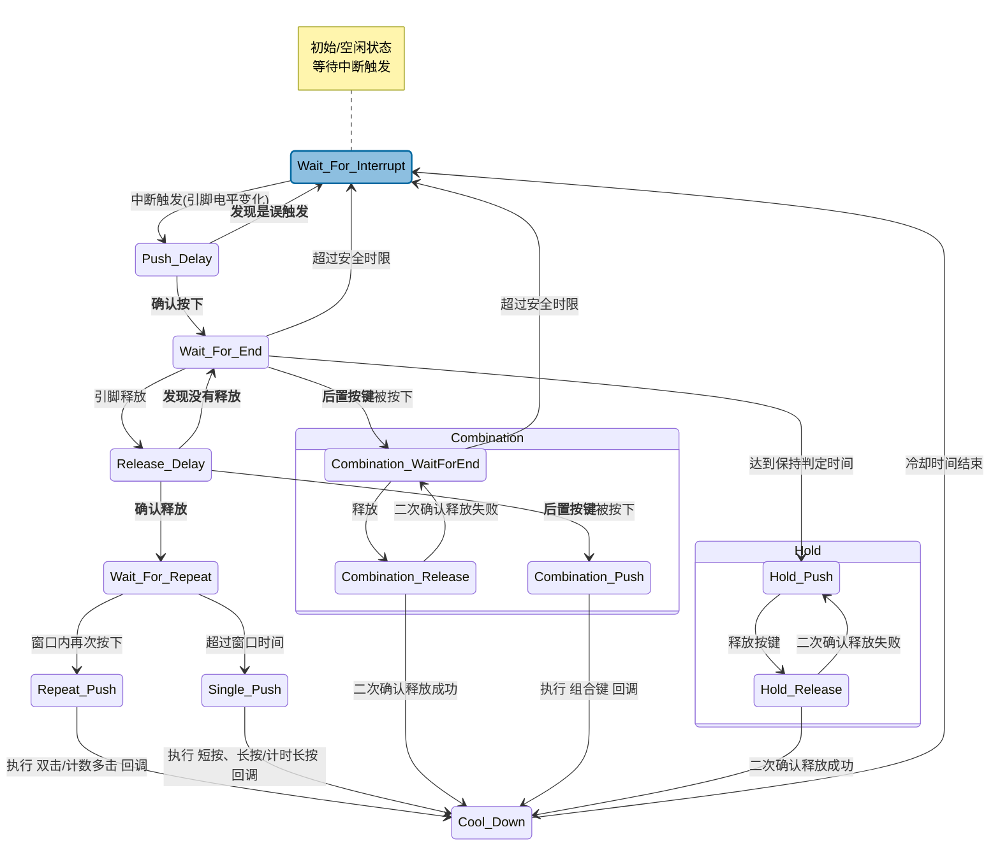

# Simple-Button
[English](./README.md)
[中文](./README_zh.md)

---

## 目录

- [目录](#目录)

- [简介](#简介)
    - [设计简介](#设计简介)
    - [功能简介](#功能简介)

- [使用方法](#使用方法)
    - [概述](#概述)
    - [详细步骤](#详细步骤)
        - [步骤1](#步骤1)
        - [步骤2](#步骤2)
    
- [进阶功能](#进阶功能)
    - [计时长按](#计时长按)
    - [计数多击](#计数多击)
    - [长按保持](#长按保持)
    - [组合键](#组合键)
    - [低功耗](#低功耗)
    - [可调时间](#可调时间)
    - [名称前缀/命名空间](#名称前缀命名空间)

- [状态机图解](#状态机图解)

- [低功耗设计](#低功耗设计)

- [动态按键](#动态按键)

- [衍生项目](#衍生项目)

---

## 简介

### 设计简介

- 按键是嵌入式设计当中最简单、最常见也最有效的输入。如今的GitHub上已经有相当多成熟的按键开源项目了，但我仍然发现了许多这些项目没有解决的问题：*有的项目按键不支持长按保持，有的项目不支持多击，有的项目不支持低功耗，有的项目的API过于复杂*。（**其中不支持低功耗这一点，其实是项目使用轮询而非中断的必然结果！**）

- 使用轮询的项目十分众多，这是因为轮询有一个天然的优点：用户只需要实现`Read_Pin()`这个函数接口就能使用，移植性强；但轮询也有天然的缺陷：CPU必须一直工作以保持持续性对按键的扫描————**这与低功耗天然矛盾**！

- 于是我产生了自己制作一个非轮询按键项目的想法。这个项目应当具有以下特点：

- 1. **功能全面** - “全面”指的是：至少支持*短按、长按、计时长按、双击、计数多击、组合键、长按保持*。
- 2. **部署简单** - “简单”指的是：**只提供一个创建按键的接口**，一行代码即可静态注册（创建）一个按键。
- 3. **使用状态机** - 目的是：非阻塞消抖的同时，具有较高的拓展性，且层次结构分明。不同于类似[lwbtn](https://github.com/MaJerle/lwbtn)那样的事件上报机制，传统的状态机虽然会导致状态种类较多，但易于调试和添加新的状态。
- 4. **使用外部中断** - 目的是：使用中断而非轮询有利于*低功耗*的支持。

- 于是，在综合考量之后，我选择**使用C语言的宏来模拟产生类似C++模板的功能**。用户只需要使用提供好的模板，就可以使用一行代码创建一个按键对象（实际上是一个结构体和三个函数）。

- 除了初始化函数需要显式调用以外，其他两个函数的调用方式是类似C++的“方法”的。这是我使用C语言进行面对对象的一次尝试。

### 功能简介

- **在[设计思想](#设计简介)的指导下，本项目实现了一个基于C99标准（或C++11标准）的纯C语言按键项目。**

1. ✅ **功能全面**： 本项目目前支持*短按、长按、计时长按、双击、计数多击、组合键、长按保持*。

2. ✅ **状态机**： 本项目使用了状态机进行代码组织，实现软件消抖，且扩展性强。但用户无需了解状态机细节即可轻松使用。

3. ✅ **外部中断**： 本项目使用外部中断触发按键，*天然支持低功耗*，项目也提供一行代码判断并进入低功耗的接口。

4. ✅ **异步处理**： 回调函数异步处理，减小中断停留时间。

5. ✅ **二次确认**： 本项目对引脚触发信号进行二次确认，即使在供电环境不稳定的场景下也能保证稳定。

6. ✅ **自定义按键**： 本项目支持对每个按键单独设置*长按判定最小时间、多击窗口时间、冷却时间*，方便按键自定义。

7. ✅ **多线程安全**： 本项目支持开启多线程模式来保证多线程安全。

8. ✅ **调试支持**： 本项目支持开启调试模式来定位异常，方便对项目进行二次开发。

[回到目录](#目录)

---

## 使用方法

### 概述

- 由于本项目是一个跨平台项目，它的所有接口都是抽象的，或者说：所有接口都需要使用者根据所使用的芯片进行自定义。从这个方面来讲，本项目只是个“半成品”。如果您希望直接“开箱即用”，可以看一看[衍生项目](#衍生项目)您需要的芯片的定制化版本。如果有，您可以直接下载，跳过步骤1，直接进行步骤2。

- 步骤1：您需要针对您的芯片进行定制化改造（在`simple_button_config.h`中进行）：
    - 1.1 - 在文件`simple_button_config.h`开头的 **Head-File** 添加芯片头文件。
    - 1.2 - 在文件`simple_button_config.h`开头的 **Simple-Button-Type** 调整类型定义。
    - 1.3 - 在文件`simple_button_config.h`开头的 **Other-Functions** 实现抽象接口。
    - 1.4 - 在文件`simple_button_config.h`开头的 **Initialization-Function** 实现EXTI初始化函数。

- 步骤2：使用项目，部署、使用按键：（ **[]** 代表可选步骤）
    - 2.1   - 使用 **SIMPLEBTN__CREATE()** 宏 创建需要的按键。
    - [2.2] - 使用 **SIMPLEBTN__DECLARE()** 宏 声明创建的按键（如果在另一个文件使用）。
    - 2.3   - 在`main`函数`while`循环之前调用按键初始化函数。
    - 2.4   - 在`while`循环内调用按键异步处理函数。
    - 2.5   - 在 EXTI 中断函数中调用按键中断处理函数。

### 详细步骤

#### 步骤1

- **衍生项目可以跳过 “步骤1”**

1. 在文件`simple_button_config.h`开头的 **Head-File** 添加芯片头文件。添加的头文件取决于具体的芯片。下方以STM32F103C8T6的HAL库举例：

```c
/** @b ================================================================ **/
/** @b Head-File */

#include "stm32f1xx_hal.h"

```

2. 在文件`simple_button_config.h`开头的 **Simple-Button-Type** 调整类型定义。这些类型根据具体芯片不同进行调整。例如有的芯片的GPIO_Pin_x 的类型不是`uint16_t`，而是`GPIOPin_TypeDef`，就要对下方类型进行更改。同时，应当完善`SIMPLEBTN_EXTI_TRIGGER_FALLING`的定义，补上您使用的芯片的`EXTI_TRIGGER_FALLING`值即可。

```c
/** @b ================================================================ **/
/** @b Simple-Button-Type */

// The type of GPIOX_BASE. (X can be A / B / C ...)
typedef uint32_t            simpleButton_Type_GPIOBase_t;
// The type of GPIO_PIN_X. (X can be 0 / 1 / 2 / 3 / ...)
// typedef uint16_t            simpleButton_Type_GPIOPin_t;
typedef GPIOPin_TypeDef            simpleButton_Type_GPIOPin_t; // 修改
// The type of Value of Pin. (The value usually be 0 or 1)
typedef uint8_t             simpleButton_Type_GPIOPinVal_t;
// The type of EXTI_TRIGGER_X. (X can be FALLING / RAISING / ...)
typedef uint32_t            simpleButton_Type_EXTITrigger_t;

#define SIMPLEBTN_EXTI_TRIGGER_FALLING      EXTI_TRIGGER_FALLING /* for example: EXTI_TRIGGER_FALLING */

```

3. 在文件`simple_button_config.h`开头的 **Other-Functions** 实现抽象接口。示例已在代码注释中给出，不再赘述。

```c
/** @b ================================================================ **/
/** @b Other-Functions */

#define SIMPLEBTN_FUNC_READ_PIN(GPIOX_Base, Pin) \
    /* for example: HAL_GPIO_ReadPin((GPIO_TypeDef*)(GPIOX_Base), Pin) */

#define SIMPLEBTN_FUNC_GET_TICK() \
    /* for example: HAL_GetTick() */

#define SIMPLEBTN_FUNC_PANIC(Cause, ErrorNum, etc) \
    /* for example: do { Error_Handler(ErrorNum); } while (1) */

#define SIMPLEBTN_FUNC_CRITICAL_SECTION_BEGIN() \
    /* for example: __disable_irq() */

#define SIMPLEBTN_FUNC_CRITICAL_SECTION_END() \
    /* for example: __enable_irq() */

#define SIMPLEBTN_FUNC_START_LOW_POWER() \
    /* for example: __WFI() */
```

4. 在文件`simple_button_config.h`开头的 **Initialization-Function** 实现EXTI初始化函数。此处给出STM32 HAL库示例：

```c
/** @b ================================================================ **/
/** @b Initialization-Function */

/* This macro just forward the parameter to another function */
#define SIMPLEBTN_FUNC_INIT_EXTI(GPIOX_Base, GPIO_Pin_X, EXTI_Trigger_X) \
    simpleButton_Private_InitEXTI(GPIOX_Base, GPIO_Pin_X, EXTI_Trigger_X) // It is implemented below


#if defined(__GNUC__) || defined(__clang__)
    static inline __attribute__((always_inline))
#elif defined(_MSC_VER) || defined(__CC_ARM)
    static __forceinline
#else
    static inline
#endif /* defined(__GNUC__) || defined(__clang__) */
void simpleButton_Private_InitEXTI(
    simpleButton_Type_GPIOBase_t    GPIOX_Base,
    simpleButton_Type_GPIOPin_t     GPIO_Pin_X,
    simpleButton_Type_EXTITrigger_t EXTI_Trigger_X
) {
    /* Initialize the AFIO Clock(F1xx) or SYSCFG Clock */
#if defined(__HAL_RCC_AFIO_CLK_ENABLE)
    __HAL_RCC_AFIO_CLK_ENABLE();
#elif defined(__HAL_RCC_SYSCFG_CLK_ENABLE)
    __HAL_RCC_SYSCFG_CLK_ENABLE();
#else
 #warning Cannot find macro for AFIO or SYSCFG !
#endif /* AFIO or SYSCFG */

    /* Initialize the GPIOx Clock */
    switch (GPIOX_Base) {
    case GPIOA_BASE:
        __HAL_RCC_GPIOA_CLK_ENABLE();
        break;
    case GPIOB_BASE:
        __HAL_RCC_GPIOB_CLK_ENABLE();
        break;
    case GPIOC_BASE:
        __HAL_RCC_GPIOC_CLK_ENABLE();
        break;
    case GPIOD_BASE:
        __HAL_RCC_GPIOD_CLK_ENABLE();
        break;
    case GPIOE_BASE:
        __HAL_RCC_GPIOE_CLK_ENABLE();
        break;
    default:
        /* ... error handler ... */
    }

    /* Configure the GPIOx */
    GPIO_InitTypeDef gpio_config;
    gpio_config.Mode = (EXTI_Trigger_X == EXTI_TRIGGER_RISING)
        ? (GPIO_MODE_IT_RISING) : (GPIO_MODE_IT_FALLING);
    gpio_config.Pin = (uint32_t) GPIO_Pin_X;
    gpio_config.Pull = (EXTI_Trigger_X == EXTI_TRIGGER_RISING)
        ? (GPIO_PULLDOWN) : (GPIO_PULLUP);
    gpio_config.Speed = GPIO_SPEED_FREQ_LOW;
    HAL_GPIO_Init((GPIO_TypeDef*)GPIOX_Base, &gpio_config);

    /* Initialize the EXTI */
    IRQn_Type the_exti_IRQ;
    switch (GPIO_Pin_X) {
    case GPIO_PIN_0:
        the_exti_IRQ = EXTI0_IRQn;
        break;
    case GPIO_PIN_1:
        the_exti_IRQ = EXTI1_IRQn;
        break;
    case GPIO_PIN_2:
        the_exti_IRQ = EXTI2_IRQn;
        break;
    case GPIO_PIN_3:
        the_exti_IRQ = EXTI3_IRQn;
        break;
    case GPIO_PIN_4:
        the_exti_IRQ = EXTI4_IRQn;
        break;
    case GPIO_PIN_5:
        the_exti_IRQ = EXTI9_5_IRQn;
        break;
    case GPIO_PIN_6:
        the_exti_IRQ = EXTI9_5_IRQn;
        break;
    case GPIO_PIN_7:
        the_exti_IRQ = EXTI9_5_IRQn;
        break;
    case GPIO_PIN_8:
        the_exti_IRQ = EXTI9_5_IRQn;
        break;
    case GPIO_PIN_9:
        the_exti_IRQ = EXTI9_5_IRQn;
        break;
    case GPIO_PIN_10:
        the_exti_IRQ = EXTI15_10_IRQn;
        break;
    case GPIO_PIN_11:
        the_exti_IRQ = EXTI15_10_IRQn;
        break;
    case GPIO_PIN_12:
        the_exti_IRQ = EXTI15_10_IRQn;
        break;
    case GPIO_PIN_13:
        the_exti_IRQ = EXTI15_10_IRQn;
        break;
    case GPIO_PIN_14:
        the_exti_IRQ = EXTI15_10_IRQn;
        break;
    case GPIO_PIN_15:
        the_exti_IRQ = EXTI15_10_IRQn;
        break;
    default:
        /* ... error handler ... */

    }
    HAL_NVIC_SetPriority(
        the_exti_IRQ, 
        EXTI_PreemptionPriority, /* your priority */
        EXTI_SubPriority /* your priority */
    );
    HAL_NVIC_EnableIRQ(the_exti_IRQ);

}
```

#### 步骤2

0. 创建按键只需要一个宏就可以实现。但在实际项目中我们往往希望用一个单独的`.c`文件管理所有需要的按键，并提供一个`.h`文件作为使用的接口。本项目提供的两个接口宏分别可以很好的完成`创建`+`声明`两个工作。一般项目的目录结构如下，**下方步骤2.1~2.5使用的就是这样的目录结构**：
```markdown
.
|
+-- simple_button_config.h  # 本项目提供的头文件，负责提供配置信息
|
+-- Simple_Button.h  # 本项目提供的主要头文件
|
+-- Simple_Button.c  # 本项目提供的主要源文件
|
+-- my_buttons.c  # 用户自己的文件，所有按键在这个文件内创建，统一管理。
|
+-- my_buttons.h  # 用户自己的文件，所有按键的声明都在这个文件中。
|
+-- main.c  # 用户自己的文件，包含 my_buttons.h ，使用按键。

```

1. 使用 **SIMPLEBTN__CREATE()** 宏 创建需要的按键。创建3个按键，分别连接`GPIOA-Pin0`, `GPIOB-Pin1`, `GPIOD-Pin14`，都是下降沿触发，分别起名为`SB1`, `SB2`, `SB3`，STM32-HAL示例如下（以下代码位于`my_buttons.c`）：

```c
#include "Simple_Button.h"

/* 宏后方不用加 ';' */

SIMPLEBTN__CREATE(GPIOA_BASE, GPIO_PIN_0, EXTI_TRIGGER_FALLING, SB1)

SIMPLEBTN__CREATE(GPIOB_BASE, GPIO_PIN_1, EXTI_TRIGGER_FALLING, SB2)

SIMPLEBTN__CREATE(GPIOD_BASE, GPIO_PIN_14, EXTI_TRIGGER_FALLING, SB3)

```

2. 使用 **SIMPLEBTN__DECLARE()** 宏 声明创建的按键（如果在另一个文件使用）。承接2.1创建的三个按键，这里演示如何在 `my_buttons.h` 中声明三个已创建的按键。

```c
#include "Simple_Button.h"

/* 宏后方不用加 ';' */

SIMPLEBTN__DECLARE(SB1)

SIMPLEBTN__DECLARE(SB2)

SIMPLEBTN__DECLARE(SB3)

```

3. 在`main`函数`while`循环之前调用按键初始化函数。承接前一步，示例如下：

```c
#include "my_buttons.h"

int main(void) {

    SimpleButton_SB1_Init();
    SimpleButton_SB2_Init();
    SimpleButton_SB3_Init();

    while (1) {

    }
}

```

4. 在`while`循环内调用按键异步处理函数。承接上一步，准备好`短按`、`长按`、`双击`的回调函数（更多功能的用法详见[进阶功能](#进阶功能)），并传入`while`循环内按键异步处理函数，示例如下（以下代码位于`main.c`）：

```c
#include "my_buttons.h"

/* 准备好`短按`、`长按`、`双击`的回调函数，默认情况下无参无返回值 */
void TurnOn_LED(void) {
    /* 函数名随意，无参无返回即可 */
    /* 函数会在对应事件触发后被调用 */
}

void DoSomething(void) {
    /* ... */
}

int main(void) {

    SimpleButton_SB1_Init();
    SimpleButton_SB2_Init();
    SimpleButton_SB3_Init();

    while (1) {
        // 依次传入 `短按`、`长按`、`双击`的回调函数，不需要则传 NULL 或 0。
        SimpleButton_SB1.Methods.asynchronousHandler(
            TurnOn_LED,
            NULL,
            DoSomething
        );
        SimpleButton_SB2.Methods.asynchronousHandler(
            NULL,
            NULL,
            DoSomething
        );
        SimpleButton_SB3.Methods.asynchronousHandler(
            NULL,
            DoSomething,
            NULL
        );
    }
}

```

5. 最后一步，在 EXTI 中断函数中调用按键中断处理函数。这里分为两种情况：1. **需要自己去实现中断函数**。 2. **已经有现成的中断回调函数**（如STM32的HAL库使用CubeMX生成代码），这里分别举例说明：

    - **需要自己去实现中断函数**。大多数单片机裸机开发都需要这样做。去汇编启动文件中找到`中断向量表`，然后找到EXTI对应引脚的中断，实现中断函数。依旧承接上一步，以 STM32 标准库为例：

    ```c
        // SB1 是 Pin0
        void EXTI0_IRQHandler(void) {
            if (EXTI_GetITStatus(EXTI_Line0) == SET) {
                SimpleButton_SB1.Methods.interruptHandler();

                EXTI_ClearITPendingBit(EXTI_Line0);
            }
        }

        // SB2 是 Pin1
        void EXTI1_IRQHandler(void) {
            if (EXTI_GetITStatus(EXTI_Line1) == SET) {
                SimpleButton_SB2.Methods.interruptHandler();

                EXTI_ClearITPendingBit(EXTI_Line1);
            }
        }

        // SB3 是 Pin14
        void EXTI15_10_IRQHandler(void) {
            if (EXTI_GetITStatus(EXTI_Line14) == SET) {
                SimpleButton_SB3.Methods.interruptHandler();

                EXTI_ClearITPendingBit(EXTI_Line14);
            }
        }
    ```

    - **已经有现成的中断回调函数**。直接找到生成好的回调函数，在其中调用`interruptHandler()`即可。承接上一步，以STM32 CubeMX生成的HAL库为例，在`stm32f1xx_hal_gpio.c`里提供了这个弱函数接口：

    ```c
    __weak void HAL_GPIO_EXTI_Callback(uint16_t GPIO_Pin)
    {
        /* Prevent unused argument(s) compilation warning */
        UNUSED(GPIO_Pin);
        /* NOTE: This function Should not be modified, when the callback is needed,
           the HAL_GPIO_EXTI_Callback could be implemented in the user file
        */
    }
    ```

    所以，我们复制上方代码到`main.c`，并在其中调用`interruptHandler()`，示例如下：

    ```c
    // 不使用 __weak
    void HAL_GPIO_EXTI_Callback(uint16_t GPIO_Pin)
    {
        switch (GPIO_Pin) {
        case GPIO_PIN_0: {
            SimpleButton_SB1.Methods.interruptHandler();
            break;
        }
        case GPIO_PIN_1: {
            SimpleButton_SB2.Methods.interruptHandler();
            break;
        }
        case GPIO_PIN_14: {
            SimpleButton_SB3.Methods.interruptHandler();
            break;
        }
        }
    }
    ```

[回到目录](#目录)

---

## 进阶功能

### 计时长按
- 有的时候，单一的长按不能满足我们的需求，我们希望不同时长的长按能有不同的效果。这个时候就需要使用**计时长按**这个高级功能。
- 在文件`simple_button_config.h`开头的`CUSTOMIZATION`中找到`Mode-Set`，将`#define SIMPLEBTN_MODE_ENABLE_TIMER_LONG_PUSH           0`改为`#define SIMPLEBTN_MODE_ENABLE_TIMER_LONG_PUSH           1`，即可启用**计时长按**。
- 启用此功能后，按键的长按回调函数将**不再是无参无返回值类型，变为有`uint32_t`参数而无返回值的类型**，该类型接收的值为长按时间。
- 示例如下（初始化函数、中断处理、短按/双击回调在此处没有特殊变化，省略不演示）：

```c
/* 需要在文件`simple_button_config.h`开头的 Mode-Set 处改变宏定义的值以启用计时长按 */
#define SIMPLEBTN_MODE_ENABLE_TIMER_LONG_PUSH           1

/* 准备好有参的长按回调函数 */
void TimerLongPush_CallBack(uint32_t pushTime) {
    if (pushTime < 5000) {
        /* 长按小于5秒 功能1 */
    } else {
        /* 长按大于等于5秒 功能2 */
    }
}

int main(void) {
    /* ... */
    while (1) {
        SimpleButton_SB1.Methods.asynchronousHandler(
            NULL,
            TimerLongPush_CallBack,
            NULL
        );
    }
}

/* ... */

```

### 计数多击
- 有的时候，简单的双击不能满足我们的需求。我们可能需要3击、4击…… 这时，我们就需要开启**计数多击**这个功能。
- 在文件`simple_button_config.h`开头的`CUSTOMIZATION`中找到`Mode-Set`，将`#define SIMPLEBTN_MODE_ENABLE_COUNTER_REPEAT_PUSH       0`改为`#define SIMPLEBTN_MODE_ENABLE_COUNTER_REPEAT_PUSH       1`，即可启用**计数多击**。
- 启用此功能后，按键的**无参无返回值双击回调函数会变为有`uint8_t`参数且无返回值的函数**，此参数接收实际按下的次数。所以原先传入双击回调函数的地方实际上就变成了传入计数多击回调函数。
- 示例如下（初始化函数、中断处理、短按/长按回调在此处没有特殊变化，省略不演示）：

```c
/* 需要在文件`simple_button_config.h`开头的 Mode-Set 处改变宏定义的值以启用计数多击 */
#define SIMPLEBTN_MODE_ENABLE_COUNTER_REPEAT_PUSH       1

/* 准备好计数多击回调函数（代替原先的双击回调） */
void CounterRepeatPush_CallBack(uint8_t pushTime) {
    switch (pushTime) {
    case 2: 
        /* ... */
        break;
    case 3:
        /* ... */
        break;
    case 4:
        /* ... */
        break;

        /* ... */
    case 10:
        /* ... */
        break;
    default:
        break;
    }
}

int main(void) {
    /* ... */
    while (1) {
        SimpleButton_SB1.Methods.asynchronousHandler(
            NULL,
            NULL,
            CounterRepeatPush_CallBack
        );
    }
}

```

### 长按保持
- 有的时候我们希望按键按下后能够间歇性地、持续地触发某个函数。这时就要使用**长按保持**功能。
- 在文件`simple_button_config.h`开头的`CUSTOMIZATION`中找到`Mode-Set`，将`#define SIMPLEBTN_MODE_ENABLE_LONGPUSH_HOLD             0`改为`#define SIMPLEBTN_MODE_ENABLE_LONGPUSH_HOLD             1`，即可启用**长按保持**。
- 启用该功能后，传入的长按回调函数依然保持无参无返回值（如果您同时启用了[计时长按](#计时长按)，将会与普通的**计时长按**一样有`uint32_t`的参数），唯一的不同是这个函数会在您持续按压按键期间，周期性地被调用。
- 由于用户代码没有改变，仅回调时机发生改变，因此示例略。

### 组合键
- 有时候我们希望按键的组合能够有全新的作用。这时就要使用**组合键**功能。
- 在文件`simple_button_config.h`开头的`CUSTOMIZATION`中找到`Mode-Set`，将`#define SIMPLEBTN_MODE_ENABLE_COMBINATION               0`改为`#define SIMPLEBTN_MODE_ENABLE_COMBINATION               1`，即可启用**组合键**。
- 本项目实现组合键的方式是 `前驱按键` + `后继按键`。组合键的回调函数绑定在`后继按键`处，同时在`后继按键`处指定它的`前驱按键`。当用户在`前驱按键`按下期间，按下`后继按键`，就会触发绑定在`后继按键`上的组合键回调函数。
- 组合键是有顺序的。`按键A + 按键B` 与 `按键B + 按键A`是不同的组合键。
- 在组合键**触发后**，`前驱按键`与`后继按键`都不会触发它们的短按、长按/计时长按/长按保持、双击/计数多击回调函数。（**但在组合键触发前，如果启用了[长按保持](#长按保持)模式并先触发了长按保持回调，组合键将不会生效！！**）
- 组合键回调函数虽然不会以参数形式传入异步处理函数，但**异步处理函数不能缺失**。
- 示例如下（初始化函数、中断处理、短按/长按/多击回调在此处没有特殊变化，省略不演示）：

```c
/* 需要在文件`simple_button_config.h`开头的 Mode-Set 处改变宏定义的值以启用组合键 */
#define SIMPLEBTN_MODE_ENABLE_COMBINATION               1

// 先按SB1再按SB2的回调函数
void Cmb_SB1_then_SB2_CallBack(void) {
    /* ... */
}

// 先按SB2再按SB1的回调函数
void Cmb_SB2_then_SB1_CallBack(void) {
    /* ... */
}

int main(void) {
    /* 先进行初始化，否则会覆盖数据 */

    /* 初始化之后配置组合键 */

    // SB2的前置按键是SB1，同时配置 SB1 --> SB2 的组合回调
    SimpleButton_SB2.Public.combinationConfig.previousButton = &SimpleButton_SB1;
    SimpleButton_SB2.Public.combinationConfig.callBack = Cmb_SB1_then_SB2_CallBack;

    // SB1的前置按键是SB2，同时配置 SB2 --> SB1 的组合回调
    SimpleButton_SB1.Public.combinationConfig.previousButton = &SimpleButton_SB2;
    SimpleButton_SB1.Public.combinationConfig.callBack = Cmb_SB2_then_SB1_CallBack;

    while (1) {
        SimpleButton_SB1.Methods.asynchronousHandler(
            NULL,
            NULL,
            NULL
        );
        SimpleButton_SB2.Methods.asynchronousHandler(
            NULL,
            NULL,
            NULL
        );
    }
}

```

### 低功耗
- 当按键不被按下时，CPU空转无意义。此时可以进入低功耗模式。
- 本项目提供一个判断所有按键都处于空闲状态并进入低功耗模式的宏函数`SIMPLEBTN__START_LOWPOWER`（C99及以上或C++11及以上才提供），**一行代码进入低功耗**。
- **低功耗支持是本项目的核心设计动机**，这将在[低功耗设计](#低功耗设计)中详细展开。
- 简单示例如下（初始化、异步处理函数、中断处理函数等没有特殊变化，此处省略不演示）：

```c
/* ... */
int main(void) {
    /* ... */

    while (1) {
        if (其他条件都允许，可以进入低功耗) {
            // 这是个可变参数宏，传入全部按键对象即可
            SIMPLEBTN__START_LOWPOWER(SimpleButton_SB1, SimpleButton_SB2, SimpleButton_SB3);
        }
    }
}

/* ... */

```

### 可调时间
- 本项目有许多重要的“**判定时间**”，例如：最短的长按时间、多击的窗口时间、按键的冷却时间…… 也许您需要为不同的按键配置不同的**判定时间**，这时，你就需要使用**可调时间**功能。
- 在文件`simple_button_config.h`开头的`CUSTOMIZATION`中找到`Mode-Set`，将`#define SIMPLEBTN_MODE_ENABLE_ADJUSTABLE_TIME         0`改为`#define SIMPLEBTN_MODE_ENABLE_ADJUSTABLE_TIME         1`，即可启用**可调时间**。
- 示例如下（初始化、异步处理函数、中断处理函数等没有特殊变化，此处省略不演示）：

```c

/* 需要在文件`simple_button_config.h`开头的 Mode-Set 处改变宏定义的值以启用可调时间 */
#define SIMPLEBTN_MODE_ENABLE_ADJUSTABLE_TIME         1

int main(void) {
    /* ... */
    /* 先进行初始化，否则会覆盖数据 */

    /* 初始化之后配置可调时间 */
    SimpleButton_SB1.Public.longPushMinTime = 5000; // 最小长按时间改为5秒
    SimpleButton_SB1.Public.coolDownTime = 1000; // 冷却时间改为1秒
    SimpleButton_SB1.Public.repeatWindowTime = 0; // 不进行双击/多击判定

    while (1) {
        /* ... */
    }
}

/* ... */

```

### 名称前缀/命名空间
- 有的时候我们希望不使用`SimpleButton_`这个前缀，需要自定义前缀。这通过**名称前缀/命名空间**可以很轻松实现。
- 只需要在文件`simple_button_config.h`开头的`CUSTOMIZATION`中找到`Namespace`，将`#define SIMPLEBTN_NAMESPACE                             SimpleButton_`改为您需要的自定义前缀即可。
- 此处以`#define SIMPLEBTN_NAMESPACE                             SB_`举例：

```c
// 文件开头的`CUSTOMIZATION`中找到`Namespace`，修改以下宏
#define SIMPLEBTN_NAMESPACE                             SB_

// 假设在SIMPLEBTN__CREATE()中创建按键的时候给案件起的名字叫 myButton。

int main(void) {
    // 使用 SB_myButton_Init() 而非 SimpleButton_myButton_Init() 初始化按键
    SB_myButton_Init();

    while (1) {
        // 使用 SB_myButton 而非 SimpleButton_myButton 调用异步处理函数
        SB_myButton.Methods.asynchronousHandler(...);
    }
}

void EXTI0_IRQHandler(void) {
    // 使用 SB_myButton 而非 SimpleButton_myButton 调用中断处理函数
    SB_myButton.Methods.interruptHandler();
}

```

[回到目录](#目录)

---

## 状态机图解



[回到目录](#目录)

---

## 低功耗设计

- 低功耗是本项目设计的主要目的：使用外部中断而非轮询带来了天然的中断支持。

- 当所有按键都闲置时，可以使用类似`__WFI()`之类的函数让CPU的时钟停止，进入低功耗模式。当按键被按下，触发外部中断时，按键会被唤醒。

- 本项目提供了`SIMPLEBTN__START_LOWPOWER(...)`一键进入低功耗接口，使用方法已在[低功耗](#低功耗)给出。

- `__WFI()`固然是最简单的进入低功耗的函数，但这样做可能效果并不能完全达到预期，此处提供一些低功耗建议：

    1. 在进入低功耗模式前，建议将所有 I/O 配置成为上拉/下拉输入或模拟输入，防止芯片 I/O 浮空产生漏电流。[1]

    2. 对于芯片小封装型号，相较最大封装，未封装出的引脚，建议配置为上拉/下拉输入或模拟输入，否则可能影响电流指标。[1]

    3. 释放SWD 调试接口作为GPIO功能,并配置为上拉/下拉输入或模拟输入(唤醒后恢复SWD功能)。[1]

    4. 建议在进入低功耗模式前，彻底关闭不需要使用的外设。如果条件允许，关闭PLL切换低速时钟以节能。

[1]: 参考 https://github.com/openwch/ch32_application_notes

- 因此，您可能需要定制`SIMPLEBTN_FUNC_START_LOW_POWER()`这个宏接口，它会被`SIMPLEBTN__START_LOWPOWER(...)`调用。伪代码示例如下：

```c
// 在文件`simple_button_config.h`开头的 Other-Functions 处找到它
#define SIMPLEBTN_FUNC_START_LOW_POWER()    simpleButton_start_low_power()

static inline void simpleButton_start_low_power(void) {
    config_GPIO_IPD_for_low_power();
    Disable_SWD();
    Disable_some_Periph();
    Disable_PLL();

    __WFI();

    Enable_PLL();
    Enable_some_Periph();
    Enable_SWD();
    config_GPIO_normal();
}

```

[回到目录](#目录)

---

## 动态按键

- 有的时候，我们需要动态地创建按键，又或者我们需要同时使用`PA0`与`PB0`这类相同拥有相同编号的引脚作为按键引脚。本项目主要提供的基于`EXTI`的按键恐怕难以胜任。

- 为此，本项目提供了**动态按键**，一个基于轮询的按键子项目，作为补充。

- **动态按键**复用了**基于`EXTI`按键**的状态机函数及所有配置信息，所以不会产生额外的开销。

- **动态按键**使用轮询，配置起来简单，且没有数量和引脚限制，但无法靠自身唤醒处于低功耗的CPU。但**动态按键**可以作为*组合键*的`后继按键`使用，`前驱按键`使用**基于`EXTI`按键**即可兼顾低功耗和便捷性。

- **动态按键**使用以`SimpleButton_DynamicButton_`开头的函数进行管理。

- 创建示例如下（以STM32 HAL为例）：

```c
int main(void) {
    SimpleButton_Type_DynamicBtn_t myButton;
    SimpleButton_DynamicButton_Init(
        &myButton, // 动态按键对象的地址
        GPIOB_BASE, // 引脚的GPIO地址，这里使用的GPIOB
        GPIO_PIN_0, // 引脚号
        1 // 未被按下时的引脚电平，此处为1表示空闲状态引脚为高电平
    );
}
```

- **动态按键同样支持全部的进阶功能**，使用方法参考[进阶功能](#进阶功能)。

- 按键使用示例如下（创建过程省略不演示）：

```c
int main(void) {
    // ...
    while (1) {
        SimpleButton_DynamicButton_Handler(
            &myButton, // 动态按键对象的地址
            shortPushCallBack, // 短按回调函数
            longPushCallBack, // 长按回调函数
            repeatPushCallBack // 双击/多击回调函数
        );
    }
}
```

- **动态按键同样可以、也必须与`EXTI`按键一同传入`SIMPLEBTN__START_LOWPOWER(...)`中**。动态按键是否空闲是是否进入低功耗模式的重要判断依据，所以必须传入动态按键。只是由于动态按键不能触发中断，无法独立地将CPU从低功耗模式中唤醒。


[回到目录](#目录)

---

## 衍生项目

- 本项目的衍生项目应当遵循[衍生项目规范](./docs/Derivative-Project-Specification_zh.md)，以下简称**规范**。

- 如果您制作了一个遵循**规范**的项目，可以在issue中给出项目网址，这些项目网址将在下一个版本出现在下方。

### STM32

- [HAL库-Kim-J-Smith/STM32-SimpleButton](https://github.com/Kim-J-Smith/STM32-SimpleButton)

### CH32

- [标准库-Kim-J-Smith/CH32-SimpleButton](https://github.com/Kim-J-Smith/CH32-SimpleButton)


[回到目录](#目录)
